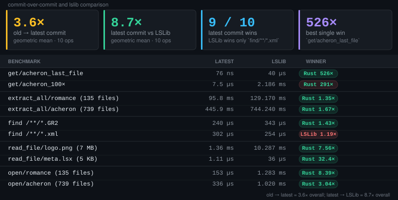

# bg3rustpaklib

A Rust library for reading, searching, extracting, and creating Baldur's Gate 3 `.pak` files (LSPK).

## Overview

`bg3rustpaklib` is a Rust-first alternative to [lslib](https://github.com/Norbyte/lslib) for BG3 modding workflows.
It focuses on fast file access, straightforward APIs, and optional features for async, regex search, and C ABI exports.



## Supported format details

- LSPK package versions: **v15, v16, v18**
- Compression methods: **none, LZ4, Zstd, zlib/deflate**
- Archive layout: regular and solid archives

## Features

- Read package metadata and enumerate packaged files
- Search by glob patterns, substring, extension, and directory
- Optional regex-based search (`regex` feature)
- Extract single files, subsets, or entire packages
- Build new `.pak` files from directories or explicit file entries
- Optional async wrapper API (`async` feature)
- Optional C-compatible ABI exports (`ffi` feature)

## Installation

```toml
[dependencies]
bg3rustpaklib = "0.1.5"
```

If you prefer semver-compatible updates within `0.1.x`, use:

```toml
[dependencies]
bg3rustpaklib = "0.1"
```

## Basic usage

```rust
use bg3rustpaklib::{Package, PackageSearch};

fn main() -> bg3rustpaklib::Result<()> {
    let package = Package::open("Game.pak")?;

    let metadata = package.metadata();
    println!("Package version: {}", metadata.version);
    println!("File count: {}", metadata.file_count);

    for file in package.files() {
        println!("{} ({} bytes)", file.name(), file.size());
    }

    let lsf_files = package.find("**/*.lsf");
    println!("Found {} .lsf files", lsf_files.len());

    if let Some(file) = package.get("Public/Game/GUI/Assets/Tooltips/tooltip.lsf") {
        let bytes = package.read_file(file)?;
        println!("Read {} bytes", bytes.len());
    }

    package.extract_all("output")?;
    Ok(())
}
```

## Feature flags

### `async`

Provides `AsyncPackage` wrappers backed by Tokio.

```toml
[dependencies]
bg3rustpaklib = { version = "0.1.5", features = ["async"] }
```

### `regex`

Enables regex-based file search helpers.

```toml
[dependencies]
bg3rustpaklib = { version = "0.1.5", features = ["regex"] }
```

### `ffi`

Enables C ABI exports (`src/ffi.rs`).
When embedding in C/C++, build as a static library:

```bash
cargo rustc --release --features ffi --crate-type staticlib
```

## Async example

```rust
use bg3rustpaklib::AsyncPackage;

#[tokio::main]
async fn main() -> bg3rustpaklib::Result<()> {
    let package = AsyncPackage::open("Game.pak").await?;
    let metadata = package.metadata().await;
    println!("File count: {}", metadata.file_count);
    Ok(())
}
```

## Included examples

Run with `cargo run --example <name> -- <args>`:

- `dump_header` – hex dumps the beginning/end of a package
- `detailed_dump` – prints package metadata and file listing details
- `compare_paks` – compares metadata across multiple packages
- `repack_test` – demonstrates extract/repack workflow

## Build and test

```bash
cargo build
cargo build --features async,regex,ffi
cargo test
cargo build --examples
```

## Documentation

- API docs: [docs.rs/bg3rustpaklib](https://docs.rs/bg3rustpaklib)
- C header: [`include/bg3rustpaklib.h`](./include/bg3rustpaklib.h)

## License

MIT — see [LICENSE](./LICENSE).

## Related projects

- Translation analyzer DLL: [`defakof/bg3rustranslatorfinder`](https://github.com/defakof/bg3rustranslatorfinder)
- Nexus page scraper DLL: [`defakof/nexus-scraper`](https://github.com/defakof/nexus-scraper)
- MO2 plugin: [`defakof/mo2-bg3-translation-checker`](https://github.com/defakof/mo2-bg3-translation-checker)

## Credits

Inspired by [lslib](https://github.com/Norbyte/lslib) by Norbyte.
